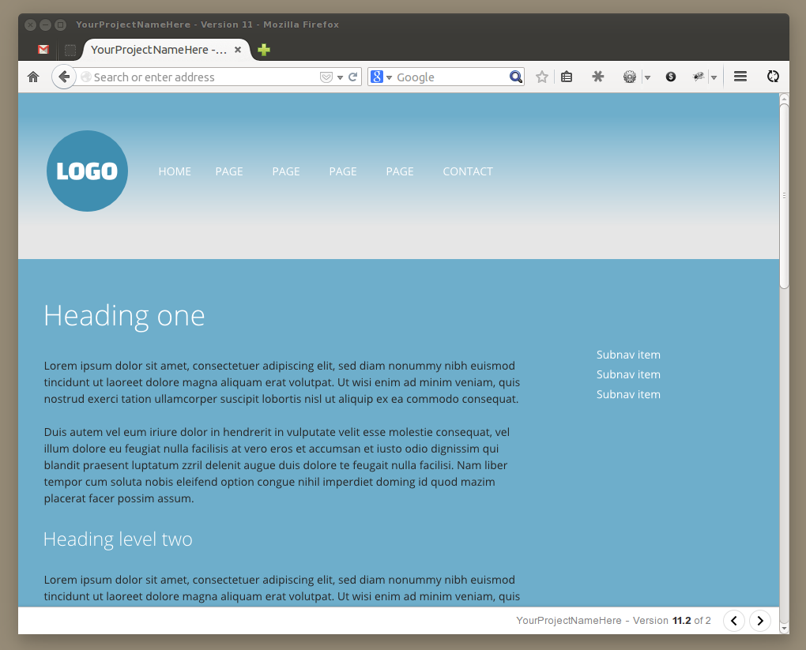

# Web design mockup presentation

A presentation tool for showing web design mockups to clients, in a browser. 

Notice the navigation at the bottom right of the screenshot.

[View a demo here](http://www.samplify.be/mckp/), with two mockup images.

Technically, it is just a html file (a template to adapt and reuse), linked to some css and javascript. In this html file, you can add your images (your mockups), all in one page. Then, thanks to some javascript and css, the user/client will only see one image at the time, and have a horizontal navigation bar at the bottom of the browser window where he will be able to click to the next or previous image, and see a little counter. Like a simple image slideshow, full screen.

To use it, you need to be familiar with html/css code.

### Why use it

- The client sees the web design mockup in the browser, so in the context of the future site;
- The mockups will be visible at full scale - no worries about zooming an image or a pdf file;
- Only a link to a url to send;
- Quick navigation buttons to go to next / previous mockup page;
- Automatically updated image number (next to version number);

It could complement other presentation tools like [style tiles](http://styletil.es/), responsive html wireframes, etc.

It is a simple tool - no online cms, no passwords, no team management, no online comment system, etc. No special transition effects.

### How to use it

- Download it
- In the downloaded folder, on the same level as index.html, put your web design mockups (as jpg or png).
- Open index.html in a text editor - you will find more detailed instructions as comments in the source code.
- Add your images inside div#content (inline images, not background images)
- (optionally) Set a background color and/or image to each parent div.
- That's it !

Test the page in your browser. Adapt if needed. When ready, upload the whole folder on your server via ftp, and send the link to the page to your client.

Your client, when viewing your page, will see the first mockup in the browser, at full scale, and have the ability to click to the next / previous mockup.

You are free to use it, customize it, make it your own.

### Who made this

This tool is heavily based on Mockup Present ([demo](http://workshop.3point7designs.com/mockup-present/)), the work of Ross Johnson and his team at 3.7 Designs. See his [blog post](http://3.7designs.co/blog/2009/08/mockup-present-a-tool-for-designers-and-developers/) for more information.

Many thanks to Ross for allowing me to customize and build on it. 

With the overall structure and  jquery magic already in place, I have made the following changes:

- changed the content and appearance of the navigation bar, and moved it to the bottom to be less intrusive;
- changed the behavior of the prev/next buttons slightly - the last mockup leads to the first and vice versa (this infinite looping can be undone by changing the variable "infinite" to "false" in the javascript)
- Inline images instead of background images - no need to add height manually. Parent divs around the images are injected automatically with jquery. All centered without horizontal scrollbar, even when wider than the browser screen.
- Changed to html5 doc type, moved css and js to external files, etc.

That's it, for now.

I'm Samuel Dellicour - I design web sites and turn them into html/css templates or full web sites.

### What's next

I want to keep this a simple tool, but I think the following things would be useful:

- change the browser url when clicking next / prev, so that a specific url/image can be bookmarked and/or sent...
- ... and then when reaching that url, one would directly see that particular image (all this as an option)
- abililty to see all images at once as clickable thumbnails (shouldn't be too hard if the images are already in the page)
- ~~Let jquery build the divs surrounding the images automatically on page load~~ Done
- A script (python?) that takes all the images in a folder, and builds the mockup presentation, like other static gallery generators. May not be worth the effort...

I'm no jquery wizard, so we'll see. Maybe with a little help of ... you ? 
